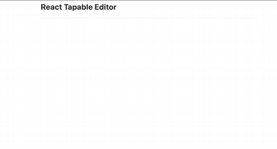
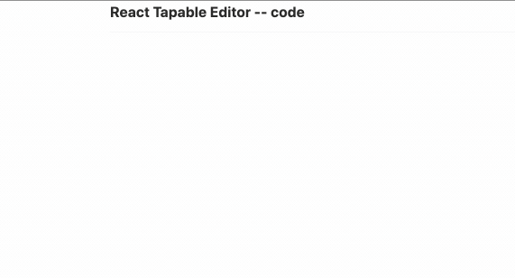
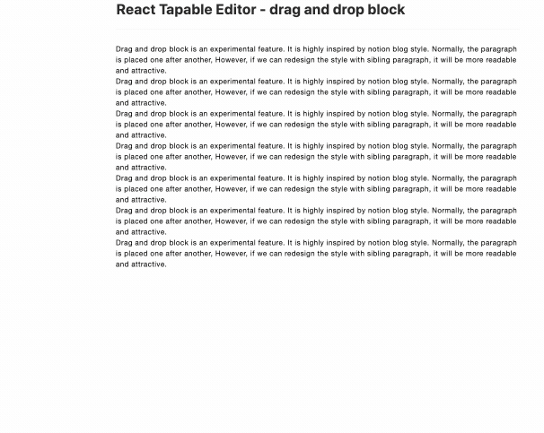

# react-tapable-editor

_A pluginable, intuitive medium/notion like rich text editor_

The original idea is to build an easy used rich text editor. `react-tapable-editor` is built on [draft-js](https://github.com/facebook/draft-js), and its plugin system is besed on [tapable](https://github.com/webpack/tapable) which is famous as the engine of [webpack](https://github.com/webpack/webpack).

## Features

### BlockStyle

- [x] header
- [x] quotation
- [x] list
- [x] quotation



#### code block

- [x] highlight with prism
- [x] copy from vscode, style could be preserved.
- [ ] copy from github, code will suppress into one line.



#### Image


### Experimental feature

#### Drag and drop block



[drag to make layout design](./docs/drag.md)

#### TODO consider smooth reflow...

## How to start

```bash
$ npm install
$ npm run examples:basic
```

## FAQ

### why choose draft-js

- [awesome-draft-js](https://github.com/nikgraf/awesome-draft-js)
- [Why Wagtail’s new editor is built with Draft.js](https://wagtail.io/blog/why-wagtail-new-editor-is-built-with-draft-js/)
- [Rethinking rich text pipelines with Draft.js](https://wagtail.io/blog/rethinking-rich-text-pipelines-with-draft-js/)
