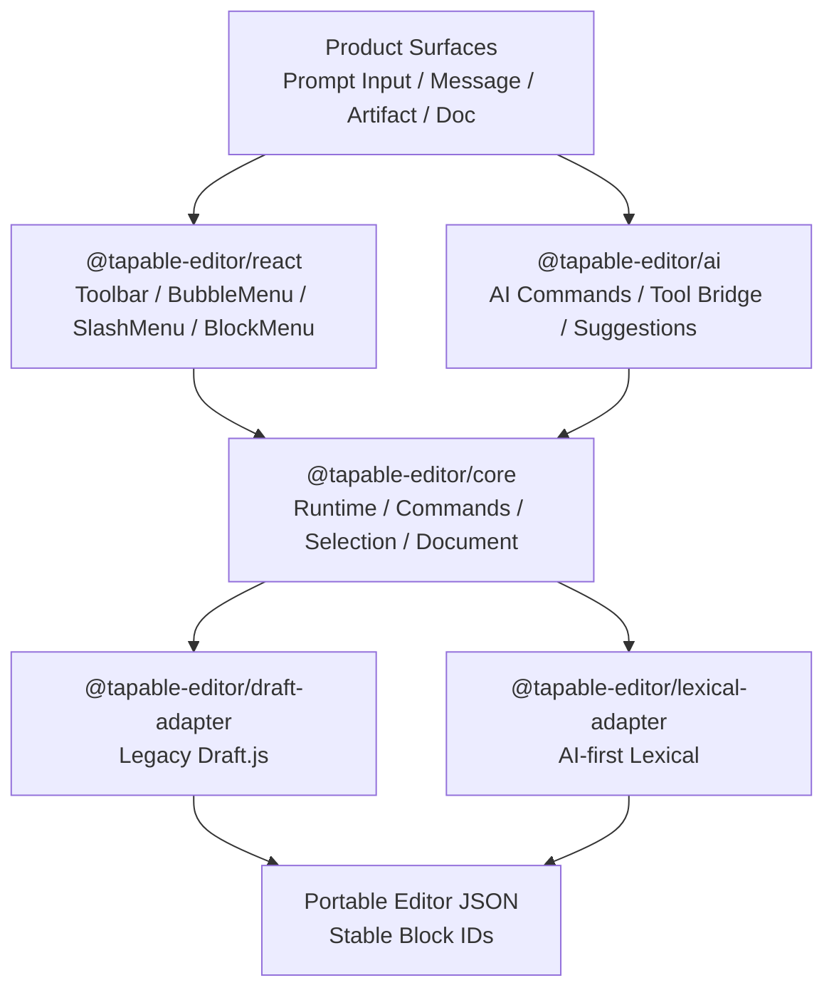

# AI Native Editor 目标架构

> 未来的编辑器不应只是富文本输入框，而应成为 AI 对话生态中的结构化交互层：输入、消息、上下文、工具调用、artifact 与 diff 都可以是同一套 block/runtime 的不同 surface。

## 来源

- [Lexical introduction](https://lexical.dev/docs/intro)
- [Lexical nodes](https://lexical.dev/docs/concepts/nodes)
- [Lexical commands](https://lexical.dev/docs/concepts/commands)
- [Vercel AI Elements Prompt Input](https://elements.ai-sdk.dev/components/prompt-input)

## 当前架构约束

当前项目的扩展能力主要集中在 `createEditor` 的 tapable hook 表中：

- `src/createEditor.tsx:49-135`：统一定义 state、style、selection、toolbar、image、drag drop、decorator 等 hook。
- `src/createEditor.tsx:161-170`：`setFinalState` 在写入状态前串接 `finalNewLine` 和 `updateBlockDepthData`。
- `src/createEditor.tsx:206-247`：block type 和 inline style 直接调用 Draft `RichUtils`。
- `src/Editor.tsx:79-90`：Draft `onChange` 进入 `stateFilter` 与 `onChange` hook。
- `src/Editor.tsx:103-114`：block rendering 委托给 `hooks.blockRendererFn`。

这说明当前项目已经有插件架构雏形，但 runtime 和 Draft 绑定过紧。目标不是丢掉 tapable 思想，而是把它提升为 editor-agnostic command/runtime。

## 目标分层



建议拆分为五层：

| 包/目录 | 职责 | 第一阶段范围 |
| --- | --- | --- |
| `src/core/` | 与内核无关的 runtime、command、selection、document schema | 新增，不改旧行为 |
| `src/adapters/draft/` | 包装现有 Draft 实现，兼容 legacy editor | 先代理 `toggleInlineStyle`、`toggleBlockType`、`insertImage` |
| `src/adapters/lexical/` | 新 Lexical runtime，服务 AI input editor | 先实现 prompt input 需要的最小节点与命令 |
| `src/react/` | 内核无关的 toolbar、menu、block UI | 后续迁移现有 components |
| `src/ai/` | AI block、message part、tool bridge、suggestion diff | 先从 `PromptInputEditor` 切入 |

## Runtime 协议草案

第一步只需要稳定最小协议，不要一次性抽象所有 Draft 能力。

```typescript
export type EditorKernel = 'draft' | 'lexical';

export interface EditorRuntime {
  kernel: EditorKernel;
  commands: EditorCommands;
  selection: EditorSelectionApi;
  document: EditorDocumentApi;
  subscribe(listener: EditorRuntimeListener): () => void;
}

export interface EditorCommands {
  focus(): void;
  blur(): void;
  toggleMark(mark: EditorMark): void;
  setBlockType(type: EditorBlockType): void;
  insertImage(payload: ImagePayload): void;
  insertBlock(block: PortableEditorNode): void;
  replaceSelection(content: PortableEditorFragment): void;
}
```

命令命名要面向产品语义，而不是直接暴露 Draft 或 Lexical API。比如 `toggleMark('bold')` 比 `RichUtils.toggleInlineStyle` 更适合作为长期 API。

## Portable Editor JSON

不要把持久化格式直接等于 Draft Raw、Lexical JSON 或 ProseMirror JSON。建议先定义轻量中间格式：

```typescript
export type PortableEditorNode = {
  id: string;
  type:
    | 'paragraph'
    | 'heading'
    | 'list'
    | 'code'
    | 'image'
    | 'mention'
    | 'context'
    | 'tool'
    | 'artifact'
    | 'suggestion';
  props?: Record<string, unknown>;
  text?: string;
  marks?: EditorMark[];
  children?: PortableEditorNode[];
};
```

关键原则：

- `id` 必须稳定，不能使用 Draft runtime block key 或 Lexical runtime node key 作为长期 ID。
- AI patch、评论、引用、diff、accept/reject 都围绕 stable block id 工作。
- adapter 负责将 portable node 转成具体内核节点。
- 存储层保留 `kernelPayload` 可选字段，用于短期兼容无法完全表达的 legacy 内容。

## AI Native Block 语法

AI chat 生态里的 block 不应局限于富文本：

| Block | 用途 | UI 行为 |
| --- | --- | --- |
| `context` | @文件、@网页、@选区、@数据源 | chip，可删除、展开、引用 |
| `tool` | AI tool call / function call | 状态机：pending、running、success、error、approval required |
| `artifact` | AI 生成的代码、图表、表格、文档片段 | 可打开、编辑、版本化 |
| `suggestion` | AI 改写建议或 diff | accept/reject，可定位来源 |
| `codePatch` | 对代码或文档的补丁 | 展示 diff，支持 apply |
| `media` | 图片、视频、音频、附件 | 上传状态、预览、引用 |

这些 block 的存在意味着 editor runtime 需要支持“文本 + 交互对象 + agent operation”。

## Agent 操作层

AI 不应该直接操作 DOM，也不应该直接写具体内核 JSON。它应该通过受控命令操作 editor：

```typescript
type EditorTool =
  | { name: 'read_selection'; input: {} }
  | { name: 'read_blocks'; input: { ids?: string[] } }
  | { name: 'replace_selection'; input: { content: PortableEditorFragment } }
  | { name: 'insert_block'; input: { afterId?: string; block: PortableEditorNode } }
  | { name: 'apply_suggestion'; input: { suggestionId: string } };
```

这样有三个收益：

1. 用户操作和 AI 操作共享同一套 command layer。
2. 权限、审计、undo/redo 可以统一处理。
3. 内核迁移不会影响 AI tool contract。

## 现有 Hook 到新 Command 的映射

| 当前能力 | 现有位置 | 新 runtime 命令 |
| --- | --- | --- |
| inline style | `src/createEditor.tsx:225-247` | `commands.toggleMark(mark)` |
| block type | `src/createEditor.tsx:206-223` | `commands.setBlockType(type)` |
| image insertion | `src/plugins/AddImagePlugin.ts:10-40` | `commands.insertImage(payload)` |
| block renderer | `src/Editor.tsx:103-114` | `document.registerNodeView(type, view)` |
| selection change | `src/Editor.tsx:53-64` | `selection.subscribe(listener)` |
| drag block | `src/plugins/dnd-plugin/configNest.ts:47-91` | `commands.moveBlock(sourceId, targetId, position)` |

## Adapter 策略

### Draft Adapter

第一阶段 Draft adapter 只包装现有行为，不重写功能：

- 内部仍持有 Draft `EditorState`。
- `toggleMark` 调用 `RichUtils.toggleInlineStyle`。
- `setBlockType` 调用 `RichUtils.toggleBlockType`。
- `insertImage` 复用 `AtomicBlockUtils.insertAtomicBlock`。
- `serialize` 输出 portable JSON + legacy raw payload。

### Lexical Adapter

第一阶段 Lexical adapter 只服务 AI input editor：

- 使用 `@lexical/react`、`@lexical/rich-text`、`@lexical/history`、`@lexical/link`、`@lexical/markdown`。
- 自定义 `ContextNode`、`AttachmentNode`、`ToolIntentNode`。
- 通过 `createCommand` 暴露 `INSERT_CONTEXT_COMMAND`、`INSERT_ATTACHMENT_COMMAND`、`SUBMIT_PROMPT_COMMAND`。
- 输出 portable message payload，而不是直接输出 Lexical JSON 给业务层。

## 风险与约束

- Lexical 仍是 `0.x`，需要锁版本并通过 adapter 隔离 API 变化。
- AI block schema 早期不要过度设计，先覆盖 prompt input、context chip、attachment、tool intent。
- 当前拖拽与 nested block 强依赖 Draft block key 和 DOM selector，迁移应放到后期。
- 现有项目使用 TSDX、React 16、TypeScript 3.9，接入现代 Lexical 可能需要先做构建链隔离或新 package playground。

## 架构结论

新架构的核心不是“把 Draft 换成 Lexical”，而是把编辑器拆成：

1. editor runtime contract
2. kernel adapter
3. portable document schema
4. AI command bridge
5. React UI surface

这样 Draft、Lexical、未来的 Tiptap 都可以成为 adapter，而产品层面对的是稳定的 AI-native editor runtime。
